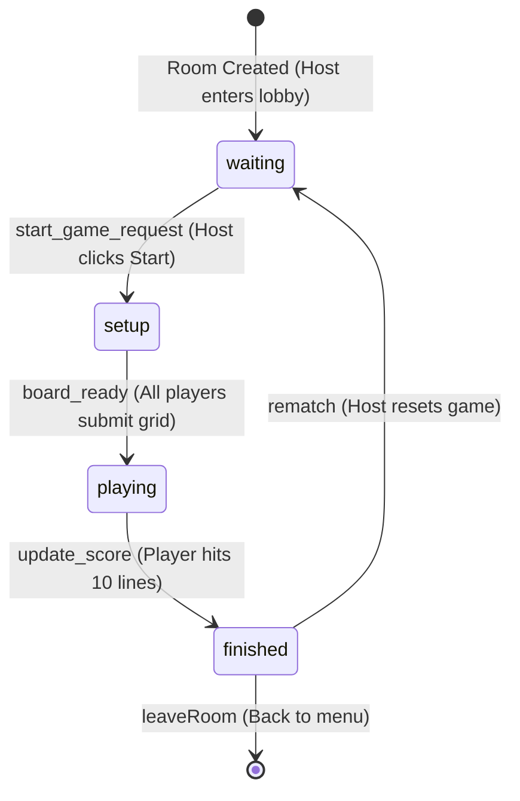

# Crazy Crack - Developer Guide for Claude

Welcome, Claude! This developer guide explains the state architecture, core algorithms, and development workflows of **Crazy Crack**. Refer to this when maintaining, debugging, or enhancing this codebase.

---

## ⚡ Game State Machine

The game flow relies on synchronized state progression between the server and the clients. The session cycles through the following statuses:



1. **`waiting`**: Players join the lobby, customize profiles, and host manages players (kick tool).
2. **`setup`**: Grids are generated (Fisher-Yates shuffled numbers 1-100). Players can re-shuffle or click "I'm Ready".
3. **`playing`**: Active turns cycle between players. Players tap numbers on their turn. Sound effects fire, lines update.
4. **`finished`**: Leaderboard is computed. Host can trigger a rematch to start the lobby loop over.

---

## 🧠 Core Algorithms

### 1. Board Line Checker (`checkLines`)
Checks for complete rows, columns, and diagonals:
* **Rows & Columns:** Loop `i` from `0` to `9`. Inner loop `j` checks if `i * 10 + j` (row) and `j * 10 + i` (column) are in the called set.
* **Diagonals:** Loops `i` from `0` to `9` checking `i * 10 + i` (main diagonal) and `i * 10 + (9 - i)` (anti-diagonal).
* Total lines checked = 22.

### 2. Bot Target Evaluator Heuristic
The bot chooses numbers using `getNumberProgressScore(number, board, calledSet)`:
1. Resolves grid coordinates for the target number (`row`, `col`).
2. Tallies called numbers in that `row` and `col`.
3. If cell lies on the main diagonal (`row === col`), counts called numbers in the main diagonal.
4. If cell lies on the anti-diagonal (`row + col === 9`), counts called numbers in the anti-diagonal.
5. Returns the maximum count among these 4 directions, indicating how close this cell is to completing a line.

---

## 🎨 Styling, Themes, and CSS Var Structure

All styles rely on custom CSS variables defined in [index.css](file:///c:/Users/green/Documents/Antigravity%20Projects/crazy-crack/client/src/index.css). When adding new components, always reference these:

```css
:root {
  --bg-color: #0b0c10;
  --panel-bg: #1f2833;
  --text-color: #c5c6c7;
  --accent-color: #66fcf1;
  --accent-glow: rgba(102, 252, 241, 0.3);
  --cell-bg: #0b0c10;
  --cell-called: #1f2833;
  --strike-color: #45f3ff;
}
```

Themes modify these variables dynamically via the `data-theme` attribute on `document.documentElement` (`[data-theme='cyberpunk']`, etc.).

---

## 🔊 Sound Synthesis (Web Audio API)

Sound effects are synthesized dynamically inside [audio.js](file:///c:/Users/green/Documents/Antigravity%20Projects/crazy-crack/client/src/utils/audio.js) to avoid loading lag and minimize asset size:
* Utilizes a shared `AudioContext` singleton.
* Volume is bounded between `0` and `1` and fetched from `localStorage`.
* Synthesized effects:
  * **Pop:** Sine wave starting at 800Hz ramping to 300Hz in 0.1s.
  * **Burn:** Sawtooth wave starting at 150Hz decaying to 50Hz in 0.3s.
  * **Melt:** Triangle wave starting at 600Hz decaying to 100Hz in 0.5s.
  * **Win:** Square wave arpeggio playing notes C (440Hz), E (554.37Hz), G (659.25Hz), C (880Hz) sequentially over 0.6s.

---

## 🛠️ Commands Reference

* **Run Express Server:** `npm start` (from `/server`)
* **Run Vite Client:** `npm run dev` (from `/client`)
* **Linting Checks:** `npm run lint` (from `/client`)
* **Production Build:** `npm run build` (from `/client`)
* **Automated Flow Test:** `node test_game_flow.js` (from project root)

---

## ⚠️ Important Developer Guidelines

* **Keep Components Reusable:** Place modular UI items inside `/client/src/components`. Avoid inline styles; use CSS classes referencing the theme variables instead.
* **React 19 Pure State Rules:** React 19 state updaters must be pure. Perform state transitions and side effects (like sound plays or redirects) outside updater functions to avoid them getting dropped.
* **Socket Safety:** Do not broadcast full player board states inside normal lobby updates. Only expose boards via security-verified channels (e.g., `get_spectator_board` API verified for winning players or spectators).
